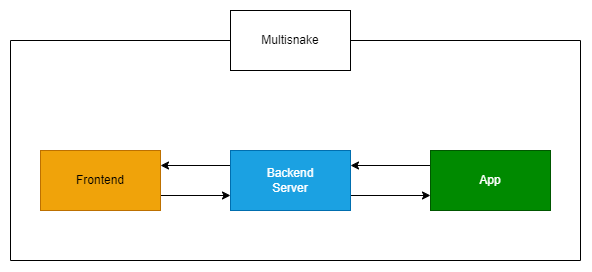

# Monitoring a Kubernetes application with Dynatrace

Our goal for this project is:
1. Take the frontend and backend of an existing project and host it using Kubernetes.
2. Monitor the application. Specifically, we plan to use:
   - **Kubernetes monitoring** (https://docs.dynatrace.com/docs/ingest-from/setup-on-k8s/how-it-works)
     - We plan to go with the Cloud native full-stack injection since host-related metrics may not be too interesting because we plan to host the project on the cloud.
     - Some interesting metrics:
       - Node resource utilization
       - Cluster health and topology
       - Container resource consumption
   - **Service monitoring** (https://docs.dynatrace.com/docs/observe/applications-and-microservices/services/analysis/service-analysis-new)
     - Some metrics we are particularly interested in:
       - Request Throughput
       - Response time
       - Request Failure rate
3. If time permits, we might try to add CI/CD pipelines to some parts of the project (all three components require a build step and both frontend and backend need to be hosted somewhere).

Our cloud service provider will be Google Cloud and we will be using Dynatrace for the application monitoring part.
Additionally we will try to simulate stress conditions by artificially degrading the health of the application or creating some synthetic traffic to generate some interesting data.

## Team
- Samuel Grünbacher (K12213653)
  - Set up Kubernetes on Google Cloud
- Tobias Müller (K12209522)
  - Containerize/host frontend
- Jonas Karg (K12213152)
  - Containerize/host backend

Monitoring will be done together (six-eyes principle), because the setup can be a bit more involved.
Also, the synthetic traffic generation is hard to split up three-ways, so we will try to do that part as a team as well.

## Milestones
- Set up Kubernetes on Google Cloud
- Containerize/host backend
- Containerize/host frontend
- Set up Dynatrace and monitor Project
- Simulate system degradation/high load
- (Set up CI/CD pipelines)

## Info about the base project
The project this will be based on is a multiplayer snake game called "Multisnake" that consists of a frontend, a backend and a mobile application for IOS and Android.

The backend and frontend can already be run independently of one another so it should be relatively easy to run them in containers using Kubernetes.

## Current Architecture

